# AI Based Smart Traffic Light Controller

An end to end adaptive traffic signal controller that combines **YOLOv8 computer vision**, a **Random Forest decision model**, **SUMO traffic simulation**, and a **Raspberry Pi Pico physical prototype** to adjust traffic light timing based on live vehicle demand.

This project was developed as a Computer/Electrical Engineering capstone design project at Toronto Metropolitan University. The system demonstrates how a fixed time traffic light schedule can be replaced with live vehicle detection, traffic state feature extraction, machine learning green time prediction, dynamic signal adjustment, and hardware actuation.

<p align="center">
  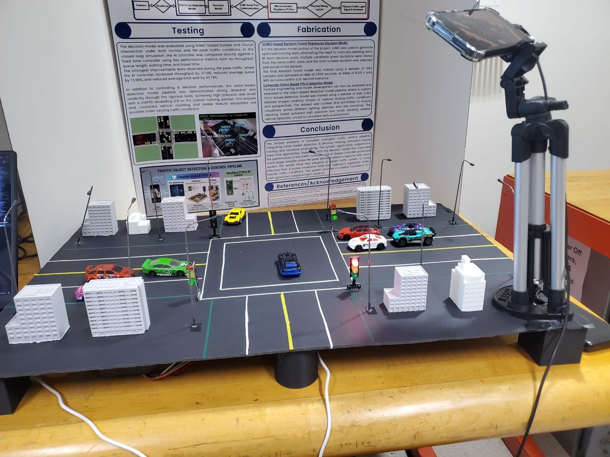
</p>

---

## Project Overview

Traditional traffic signals often rely on fixed time control, meaning each direction receives the same signal duration regardless of the actual traffic conditions. This can waste green light time on low demand lanes while congested directions continue to build longer queues.

This project solves that problem using an adaptive control pipeline:

1. A camera captures the physical intersection prototype.
2. A custom trained YOLOv8 model detects toy vehicles in real time.
3. Detected vehicles are mapped into North, South, East, West, and Center regions of interest.
4. Vehicle counts, waiting time estimates, active phase, and time of day features are sent into a Random Forest decision model.
5. The decision model predicts the base green light duration.
6. The controller dynamically extends or reduces the green time during the active phase.
7. Signal commands are sent over serial communication to a Raspberry Pi Pico, which controls the physical traffic lights.

<p align="center">
  
</p>

---

## Demo / Visual Results

### Physical Prototype

The physical system uses a scaled intersection board with lanes, road markings, traffic lights, streetlights, 3D printed buildings, a mounted camera, and Raspberry Pi Pico control hardware.

<p align="center">
  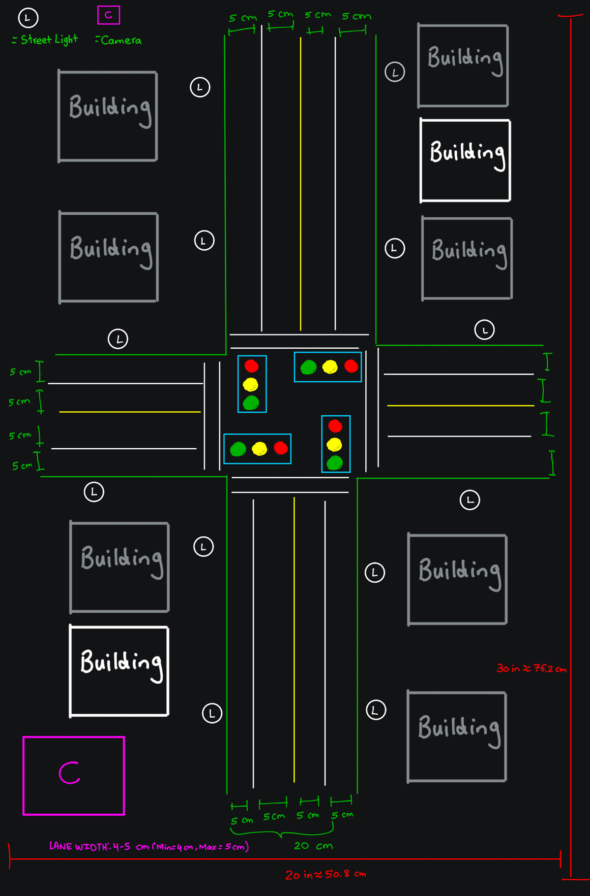
</p>

### Live Camera View and ROI Regions

The camera feed is processed at 640 x 480 resolution. Road regions are defined using polygon based ROIs so each detected car can be assigned to a traffic direction.

<p align="center">
  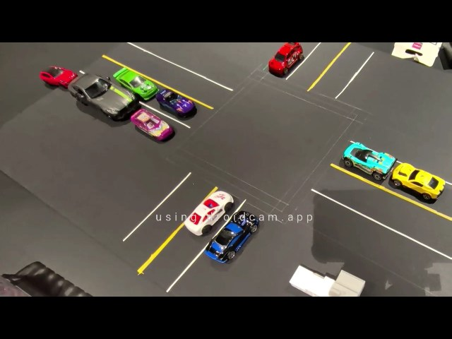
</p>

### YOLO Vehicle Detection

The YOLO detection pipeline identifies toy cars, draws bounding boxes, filters detections by class, and counts vehicles in each lane region.

<p align="center">
  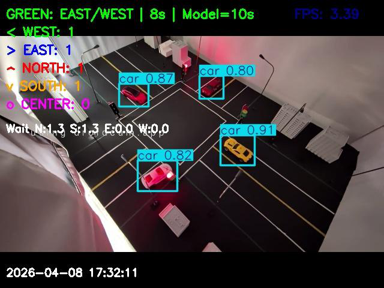
</p>

### Integrated Physical Detection Test

The final integrated system was tested on the physical prototype using real time camera input, ROI based vehicle counting, model based green time selection, and Raspberry Pi Pico signal actuation.

<p align="center">
  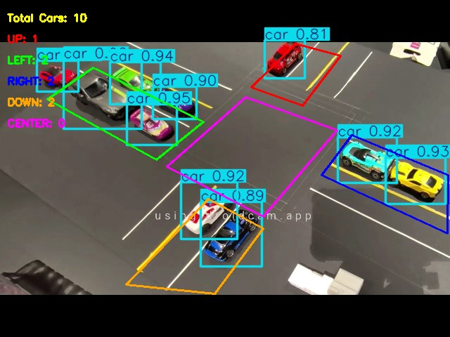
</p>

---

## Key Features

- **Real time vehicle detection:** Custom YOLOv8 model trained for toy car detection on the physical prototype.
- **ROI based traffic counting:** Vehicle bounding box centers are mapped into North, South, East, West, or Center regions.
- **Non ROI masking:** Areas outside the road network can be masked to reduce false detections.
- **Adaptive signal control:** A Random Forest model predicts green light timing from live traffic state features.
- **Dynamic green time adjustment:** The active green phase can be extended or reduced every 2 seconds based on directional imbalance.
- **Traditional vs AI mode:** The controller can run fixed time control or AI based adaptive control for comparison.
- **Hardware integration:** Serial commands are sent to a Raspberry Pi Pico to control red, yellow, and green traffic lights.
- **Data logging:** The controller records vehicle counts, wait estimates, signal states, cycle logs, screenshots, and video output.
- **Red light violation capture:** Vehicles detected in the center region during an all red state can be flagged and saved.
- **Interactive ROI editing:** ROI polygon vertices can be adjusted live using mouse based edit mode.

---

## Tech Stack

| Area | Tools / Libraries |
|---|---|
| Computer Vision | YOLOv8, Ultralytics, OpenCV |
| Machine Learning | scikit-learn, RandomForestRegressor, joblib |
| Simulation | SUMO, TraCI, Python |
| Hardware Control | Raspberry Pi Pico, serial communication, GPIO traffic lights |
| Data Processing | NumPy, Pandas, CSV logging |
| Visualization | Matplotlib, OpenCV overlays |
| Language | Python |

---

## Repository Structure

```text
AI-Smart-Traffic-Light-Controller/
|
|-- README.md
|-- requirements.txt
|-- .gitignore
|
|-- TrafficLight_MainPico_Final_.py       # Main integrated real time controller
|-- train.py                              # YOLOv8 training script
|-- image_testing.py                      # Image based detection testing
|-- webcam_capture.py                     # Camera capture utility
|-- PixelToRealDistance.py                # Pixel to real distance calibration helper
|-- CityTrafficData.py                    # Traffic data graphing/analysis helper
|
|-- DecisionModel/
|   |-- decision_model.py                 # Loads trained Random Forest model and predicts green time
|   |-- decision_model.pkl                # Trained decision model bundle
|   |-- train_decision_model.py           # Trains the Random Forest model
|   |-- generate_data.py                  # Generates decision model training data
|   |-- dundasChurch.py                   # SUMO based Dundas/Church simulation controller
|   |-- runSumo.py                        # SUMO execution script
|   |-- test_model.py                     # Decision model testing script
|   |-- Graphs/                           # SUMO result graphs and comparison CSVs
|   |-- simTraffic/                       # SUMO route files
|   `-- sim_results/                      # SUMO result XML files
|
|-- TOYCAR_Dataset/
|   |-- data.yaml                         # YOLO dataset config
|   |-- train/images, train/labels        # Reduced sample: 10 images + labels
|   |-- valid/images, valid/labels        # Reduced sample: 10 images + labels
|   `-- test/images, test/labels          # Reduced sample: 10 images + labels
|
|-- runs/detect/toycar_model6/
|   |-- results.png                       # YOLO training metrics
|   `-- weights/best.pt                   # Final trained YOLO model weights
|
|-- images/                               # Example input/test images
|-- results/                              # Example annotated detection results
|-- City Traffic Data 2024-2026 (Graphs)/ # Real traffic data visualizations
`-- assets/readme/                        # Images used by this README
```

---

## System Architecture

### 1. Camera and Input Stream

A phone camera is used as the live video source through DroidCam. Frames are captured by the computer, resized to 640 x 480, and passed into the computer vision pipeline.

### 2. YOLOv8 Car Detection Model

The YOLOv8 model detects toy cars in real time. The model output is filtered to the `car` class, then each bounding box center is checked against the intersection ROI polygons.

The full YOLO training process used a larger custom toy car dataset collected under varying lighting conditions, traffic densities, and perspectives. To keep the GitHub repository practical, this version includes a reduced sample dataset with **10 images and matching labels from each split**: `train`, `valid`, and `test`.

<p align="center">
  
</p>

### 3. Random Forest Decision Model

The decision model predicts green light duration from the current traffic state. The integrated controller uses directional vehicle counts, directional waiting times, the active phase flag, pedestrian flag, and time of day context.

Main feature groups include:

- `cars_N`, `cars_S`, `cars_E`, `cars_W`
- `wait_N`, `wait_S`, `wait_E`, `wait_W`
- active phase and opposing phase vehicle counts
- active phase and opposing phase waiting times
- vehicle pressure and waiting pressure features
- active/opposing vehicle and wait ratios
- pedestrian and hour features

<p align="center">
  
</p>

### 4. Physical Hardware Control

The Python controller sends serial commands to the Raspberry Pi Pico. The Pico then controls the physical red/yellow/green traffic lights and streetlights on the prototype.

```text
Camera -> YOLO Detection -> ROI Counts -> Decision Model -> Signal State Machine -> Raspberry Pi Pico -> Physical Traffic Lights
```

---

## Real Intersection and SUMO Comparison

The decision model and controller were also evaluated in a SUMO simulation based on the **Dundas Street / Church Street** intersection. This allowed the AI controller to be compared against a fixed time controller under the same intersection layout, route files, simulation duration, and random seed.

The real intersection comparison used observed fixed time signal settings and City of Toronto traffic volume data to approximate realistic demand. The observed average signal settings were approximately:

| Signal parameter | Approximate value |
|---|---:|
| North south green | 57 s |
| East west green | 19 s |
| Yellow | 3 s |
| All red | 6 s |

The traffic demand derivation used Dundas/Church vehicle and pedestrian counts, including a total vehicle count of 19,561, total pedestrian count of 21,094, PM peak vehicle count of 1,720, and directional approach counts for North, East, South, and West.

<p align="center">
  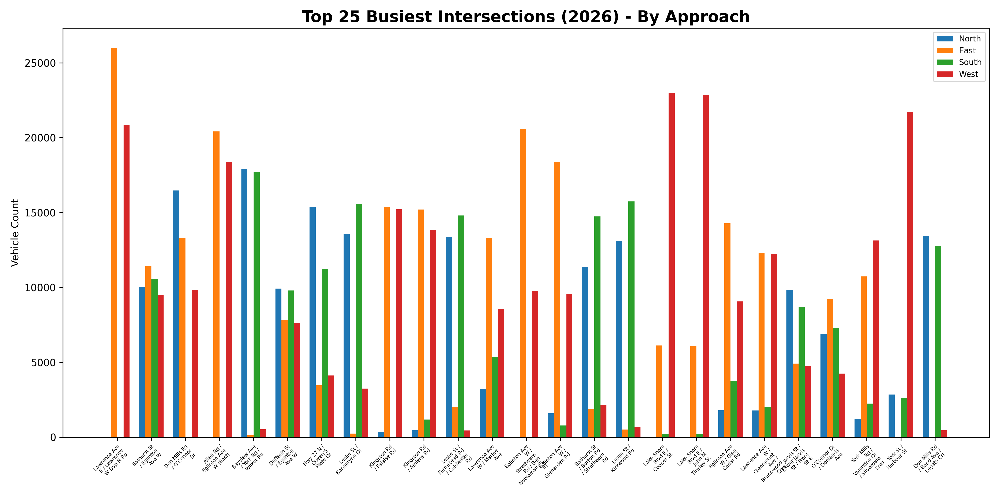
</p>

During closed loop SUMO testing, the controller was run twice for each traffic profile:

1. **Fixed time mode:** predefined green light duration.
2. **AI mode:** Random Forest base prediction with dynamic real time adjustment.

This made the comparison fair because both controllers used the same intersection layout, routes, demand profile, and simulation conditions.

### SUMO Simulation View

The screenshot below shows the Dundas/Church style SUMO intersection used during data generation and controller evaluation, with multiple approach lanes, crosswalks, and varying vehicle demand across directions.

<p align="center">
  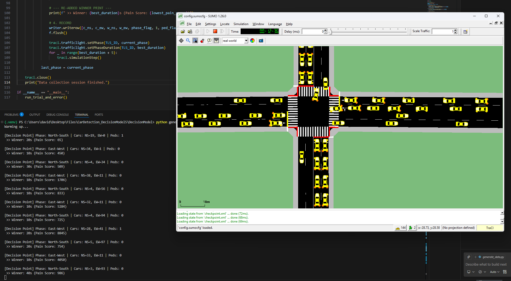
</p>

---

## Decision Model Validation

The Random Forest decision model was evaluated using an 80/20 train test split from the optimized SUMO generated dataset.

<p align="center">
  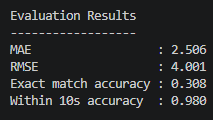
</p>

| Metric | Result |
|---|---:|
| Total samples | 1,962 |
| Training samples | 1,569 |
| Testing samples | 393 |
| MAE | 2.506 s |
| RMSE | 4.001 s |
| Exact match accuracy | 30.8% |
| Accuracy within 10 seconds | 98.0% |

---

## SUMO Simulation Results

The AI controller was compared against a fixed time controller in both normal and PM peak traffic scenarios.

### Normal Traffic Scenario

Under the normal traffic profile, the AI controller produced modest throughput gains but much stronger improvements in queue and waiting metrics.

| Metric | AI Controller Improvement |
|---|---:|
| Throughput | +0.60% |
| Average travel time | -18.60% |
| Average depart delay | -52.00% |
| Average total queue | -35.16% |
| Maximum total queue | -13.04% |
| Average total wait | -53.39% |
| Average pending insert | -52.84% |
| Completion ratio | +0.68% |

<p align="center">
  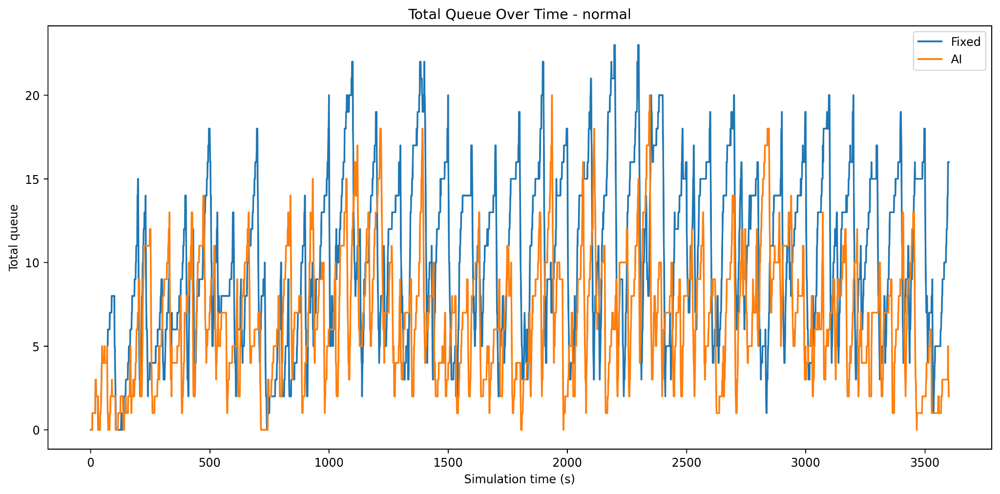
</p>

<p align="center">
  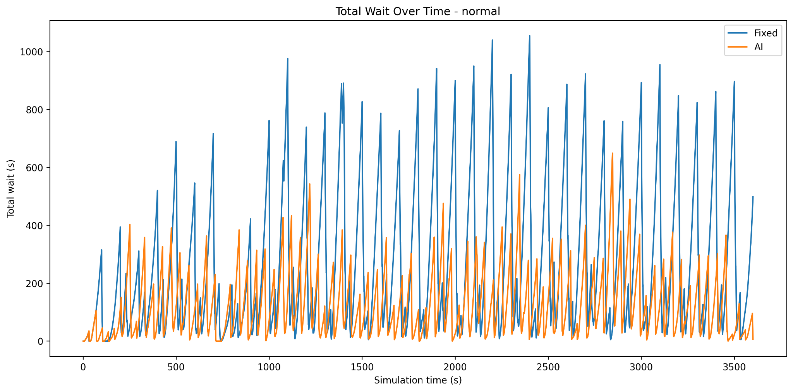
</p>

### PM Peak Traffic Scenario

The PM peak traffic profile showed larger improvements because demand was heavier and directional imbalance mattered more.

| Metric | AI Controller Improvement |
|---|---:|
| Arrivals / throughput | +37.14% |
| Average travel time | -47.43% |
| Average depart delay | -5.90% |
| Average total queue | -73.98% |
| Maximum total queue | -67.16% |
| Average total wait | -93.74% |
| Average pending insert | -55.29% |
| Completion ratio | +5.87% |

<p align="center">
  
</p>

### Dynamic Green Time Adjustment

The Random Forest prediction provides the base green duration, then the controller adjusts the active phase while the simulation is running. This lets the system respond to changing traffic after the initial prediction has already been made.

<p align="center">
  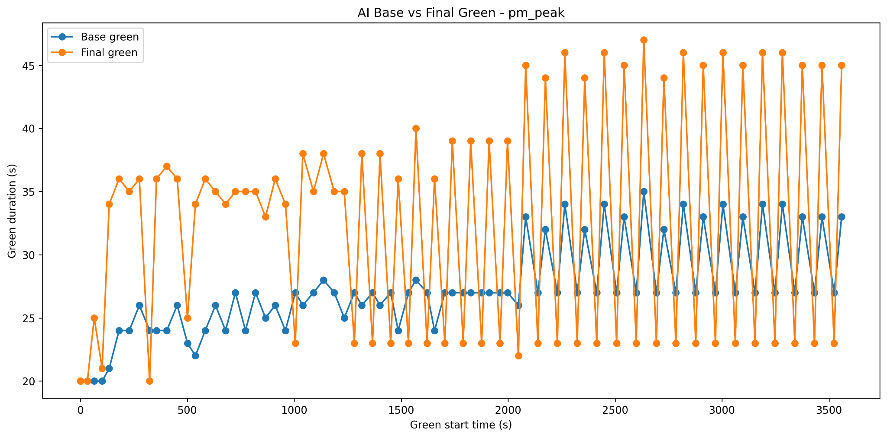
</p>

---

## Dataset Notes

The original YOLO dataset used for final model training was larger than the sample included here. For GitHub, the dataset was reduced so the repository stays manageable.

Included dataset sample:

```text
TOYCAR_Dataset/
|-- train/images   # 10 images
|-- train/labels   # 10 matching YOLO label files
|-- valid/images   # 10 images
|-- valid/labels   # 10 matching YOLO label files
|-- test/images    # 10 images
`-- test/labels    # 10 matching YOLO label files
```

The included dataset is intended to show the dataset format and annotation structure. To fully retrain the YOLO model, replace the sample dataset with the complete dataset and keep the same YOLO folder format.

---

## How to Run

### 1. Create a virtual environment

```bash
python -m venv .venv
```

Windows:

```bash
.venv\Scripts\activate
```

macOS/Linux:

```bash
source .venv/bin/activate
```

### 2. Install dependencies

```bash
pip install -r requirements.txt
```

SUMO must also be installed separately if you want to run the traffic simulations.

### 3. Run the integrated traffic controller

Make sure the camera is connected. If the Raspberry Pi Pico is plugged in, the program will auto detect it. If the Pico is not found, the program runs in test mode.

```bash
python TrafficLight_MainPico_Final_.py
```

The main controller loads:

```text
runs/detect/toycar_model6/weights/best.pt
DecisionModel/decision_model.pkl
```

---

## Keyboard Controls

While the real time camera window is running:

| Key | Action |
|---|---|
| `E` | Enter/exit ROI edit mode |
| `S` | Save updated polygon coordinates while in edit mode |
| `G` | Toggle ROI grid display |
| `N` | Toggle non ROI grid display |
| `P` | Toggle privacy mode |
| `T` | Toggle UI information overlay |
| `Q` | Quit |

---

## Training the Models

### Train YOLOv8 Detection Model

```bash
python train.py
```

This script expects the YOLO format dataset at:

```text
TOYCAR_Dataset/
```

The dataset configuration is stored in:

```text
TOYCAR_Dataset/data.yaml
```

The final trained model used by the integrated system is stored at:

```text
runs/detect/toycar_model6/weights/best.pt
```

### Train the Decision Model

```bash
cd DecisionModel
python train_decision_model.py
```

This trains the Random Forest regressor using:

```text
DecisionModel/optimal_dataset.csv
```

and saves:

```text
DecisionModel/decision_model.pkl
```

---

## Fixed Time vs AI Mode

The main controller supports both traditional fixed time operation and AI based adaptive operation.

Inside `TrafficLight_MainPico_Final_.py`:

```python
USE_TRADITIONAL_FIXED_MODE = False
FIXED_GREEN_TIME = 15
```

Set `USE_TRADITIONAL_FIXED_MODE = True` to run the traditional fixed time controller for comparison.

---

## Output Files

When the controller runs, it can generate:

```text
TrafficLight_MainPico_Final/images/
TrafficLight_MainPico_Final/red_light_camera/
TrafficLight_MainPico_Final/traffic.mp4
TrafficLight_MainPico_Final/MODERN_traffic_log.csv
TrafficLight_MainPico_Final/MODERN_cycle_log.csv
```

These generated outputs are ignored so that runtime screenshots, videos, and logs do not clutter the repository.

---

## Limitations

- The physical prototype uses toy vehicles and a scaled down road layout, so it does not represent every real world traffic condition.
- The decision model was trained using SUMO generated simulation data rather than real municipal traffic controller data.
- Dundas/Church traffic demand was approximated from available data and observations, so it should not be treated as a perfect real world traffic model.
- Detection accuracy depends on lighting, camera angle, occlusions, and ROI calibration.
- The hardware prototype uses serial communication, which can introduce small latency and synchronization limitations.
- The current system is designed for a controlled prototype intersection, not direct deployment on public roads.

---

## Project Team

Developed by:

- Dhruv Patel
- Davidy Kwok
- Harshil Suthar
- Hasib Bhuiyan

Computer/Electrical Engineering Capstone Design Project  
Toronto Metropolitan University, Fall 2025 / Winter 2026

---

## Repository Notes

This repository contains the source code, trained models, SUMO simulation files, reduced dataset sample, generated graphs, and selected report figures needed to present and run the project. Large runtime outputs such as videos, saved camera frames, and red light capture folders are excluded or ignored after execution.
