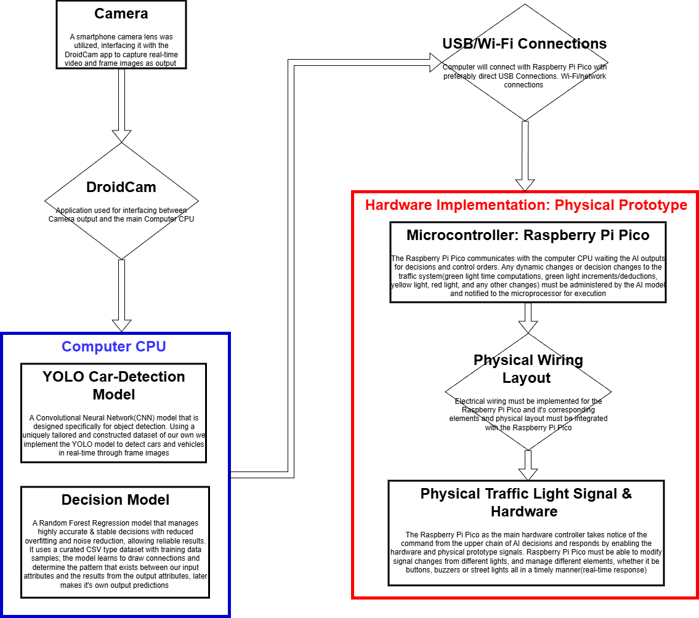
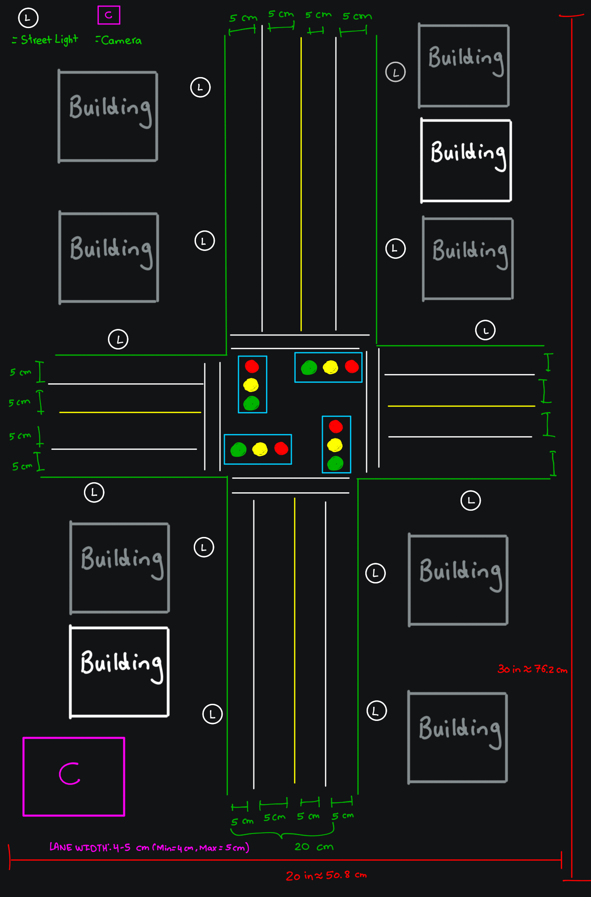
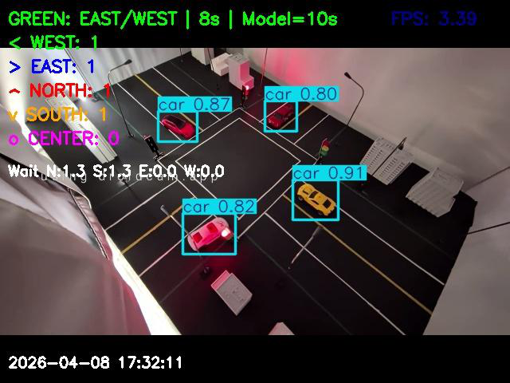
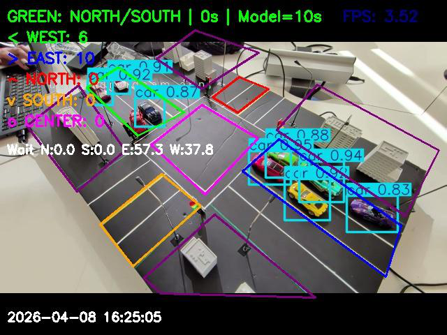
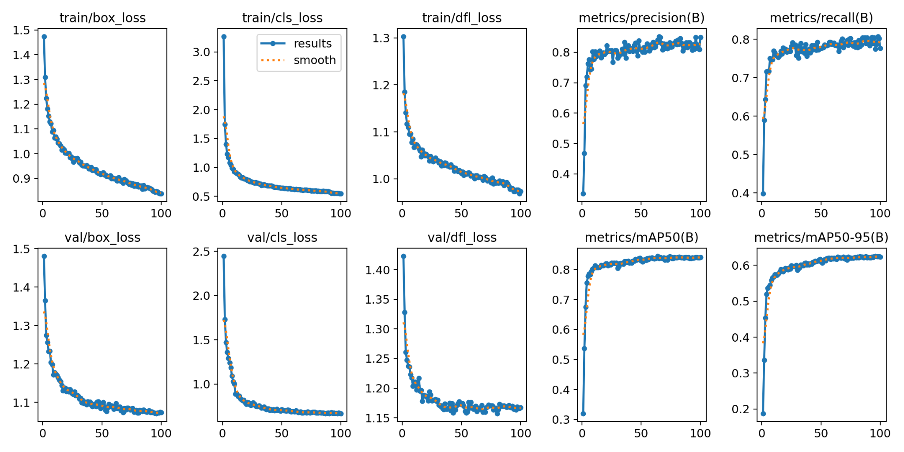
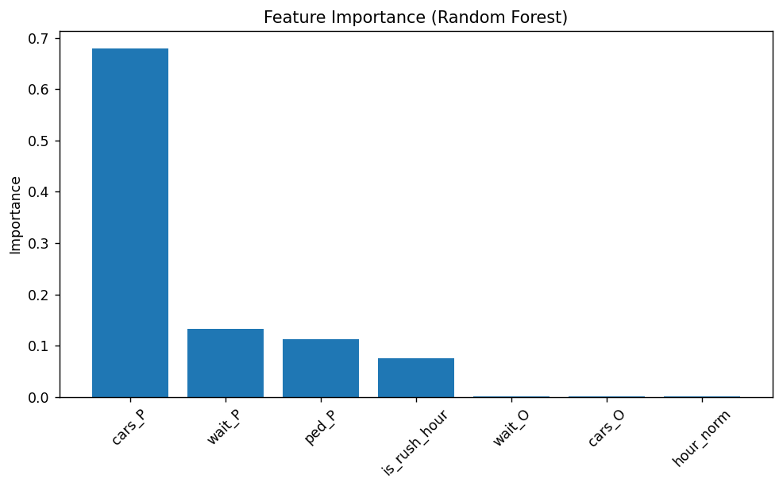
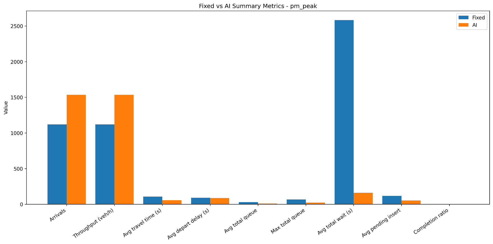

# AI-Based Smart Traffic Light Controller

An end-to-end adaptive traffic signal controller that combines **YOLOv8 computer vision**, a **Random Forest decision model**, **SUMO traffic simulation**, and a **Raspberry Pi Pico physical prototype** to dynamically adjust traffic-light timing based on real-time vehicle demand.

This project was developed as a Computer/Electrical Engineering capstone design project at Toronto Metropolitan University. The system demonstrates how an AI-based controller can replace a fixed-time traffic-light schedule with live vehicle detection, traffic-state feature extraction, model-based green-time prediction, dynamic signal adjustment, and hardware actuation.

---

## Project Overview

Traditional fixed-time traffic lights allocate the same green-light duration regardless of actual congestion. This project solves that problem by building a smart traffic controller that:

- detects toy vehicles from a live camera feed using a custom-trained YOLOv8 model,
- maps detected vehicles into intersection regions of interest (ROIs),
- estimates directional traffic counts and waiting times,
- predicts a suitable green-light duration using a Random Forest regression model,
- adjusts the green time during the active phase when traffic changes,
- sends signal commands to a Raspberry Pi Pico to control the physical traffic lights.



---

## Demo / Visual Results

### Physical Intersection Layout

The physical prototype uses a scaled intersection board with lanes, traffic lights, streetlights, buildings, a mounted camera, and Raspberry Pi Pico control hardware.



### YOLO Vehicle Detection

The detection pipeline identifies toy cars, draws bounding boxes, counts vehicles in each lane region, and displays live traffic-state information.



### Physical Prototype Detection

The final integrated system was tested on the physical intersection prototype using real-time camera input and ROI-based vehicle counting.



---

## Key Features

- **Real-time vehicle detection:** Custom YOLOv8 model trained for toy-car detection on the physical prototype.
- **ROI-based traffic counting:** Vehicles are assigned to North, South, East, West, or Center regions based on bounding-box center points.
- **Non-ROI masking:** Background areas outside the road/lane regions can be masked to reduce false detections.
- **Adaptive signal control:** A Random Forest model predicts green-light duration from current traffic state features.
- **Dynamic green-time adjustment:** Active green time can be extended or reduced every few seconds based on directional imbalance.
- **Traditional vs modern mode:** The controller can switch between fixed-time control and AI-based adaptive control for comparison.
- **Hardware integration:** Serial communication sends GREEN, YELLOW, and RED commands to a Raspberry Pi Pico.
- **Data logging:** The program saves traffic logs, cycle logs, images, and video output during execution.
- **Red-light violation capture:** Vehicles detected in the center region during all-red state can be flagged and saved.
- **Interactive ROI editing:** ROI polygon vertices can be adjusted live using edit mode.

---

## Tech Stack

| Area | Tools / Libraries |
|---|---|
| Computer Vision | YOLOv8, Ultralytics, OpenCV |
| Machine Learning | scikit-learn, RandomForestRegressor, joblib |
| Simulation | SUMO, TraCI, Python |
| Hardware Control | Raspberry Pi Pico, serial communication, GPIO traffic lights |
| Data Processing | NumPy, Pandas, CSV logging |
| Visualization | Matplotlib, OpenCV overlays |
| Programming Language | Python |

---

## Repository Structure

```text
AI-Smart-Traffic-Light-Controller/
|
|-- README.md
|-- requirements.txt
|-- .gitignore
|
|-- TrafficLight_MainPico_Final_.py       # Main integrated real-time controller
|-- train.py                              # YOLOv8 training script
|-- image_testing.py                      # Image-based detection testing
|-- webcam_capture.py                     # Camera capture utility
|-- PixelToRealDistance.py                # Pixel-to-real-distance calibration helper
|-- CityTrafficData.py                    # Traffic data graphing/analysis helper
|
|-- DecisionModel/
|   |-- decision_model.py                 # Loads trained Random Forest model and predicts green time
|   |-- decision_model.pkl                # Trained decision model bundle
|   |-- train_decision_model.py           # Trains the Random Forest model
|   |-- generate_data.py                  # Generates decision-model training data
|   |-- dundasChurch.py                   # SUMO-based Dundas/Church simulation controller
|   |-- runSumo.py                        # SUMO execution script
|   |-- test_model.py                     # Decision-model testing script
|   |-- Graphs/                           # Simulation result graphs
|   |-- simTraffic/                       # SUMO route files
|   `-- sim_results/                      # SUMO result XML files
|
|-- TOYCAR_Dataset/
|   |-- data.yaml                         # YOLO dataset config
|   |-- train/images, train/labels
|   |-- valid/images, valid/labels
|   `-- test/images, test/labels
|
|-- runs/detect/toycar_model6/
|   |-- results.png                       # YOLO training metrics
|   `-- weights/best.pt                   # Final trained YOLO model weights
|
|-- images/                               # Example input/test images
|-- results/                              # Example annotated detection results
|-- City Traffic Data 2024-2026 (Graphs)/ # Traffic data visualizations
`-- assets/report_figures/                # Figures extracted from the final project report
```

---

## System Architecture

The system is split into four major parts:

### 1. Camera and Input Stream

A phone camera is used as the live video source through DroidCam. Frames are captured by the computer, resized to 640x480, and passed into the computer-vision pipeline.

### 2. YOLOv8 Car Detection Model

The YOLOv8 model detects toy cars in real time. Detected bounding boxes are filtered to the `car` class, and the center of each bounding box is checked against the intersection ROI polygons.

The model was trained using a curated toy-car dataset with images collected under different lighting conditions, traffic densities, and camera perspectives.



### 3. Random Forest Decision Model

The decision model predicts the green-light duration from current traffic features. The final model uses directional counts, directional wait times, the active phase flag, rush-hour context, pedestrian flag, and derived pressure/ratio features.

Main feature groups include:

- `cars_N`, `cars_S`, `cars_E`, `cars_W`
- `wait_N`, `wait_S`, `wait_E`, `wait_W`
- active phase and opposing phase vehicle counts
- active phase and opposing phase waiting times
- vehicle pressure and waiting-time pressure
- active/opposing vehicle and wait ratios
- rush-hour and pedestrian flags



### 4. Physical Hardware Control

The Python controller sends serial commands to the Raspberry Pi Pico. The Pico controls the physical red/yellow/green traffic lights and streetlights on the prototype.

Signal flow:

```text
Camera -> YOLO Detection -> ROI Counts -> Decision Model -> Signal State Machine -> Raspberry Pi Pico -> Physical Traffic Lights
```

---

## Decision Model Results

The Random Forest decision model was evaluated using an 80/20 train-test split from the optimized SUMO-generated dataset.


| Metric | Result |
|---|---:|
| Training samples | 1,569 |
| Testing samples | 393 |
| MAE | 2.506 s |
| RMSE | 4.001 s |
| Exact-match accuracy | 30.8% |
| Accuracy within 10 seconds | 98.0% |

---

## SUMO Simulation Results

The AI controller was compared against a fixed-time traffic controller in both normal and PM peak traffic scenarios.

### Normal Traffic Scenario

| Metric | AI Controller Improvement |
|---|---:|
| Throughput | +0.60% |
| Average travel time | -18.60% |
| Average depart delay | -52.00% |
| Average total queue | -35.16% |
| Average total wait | -53.39% |
| Average pending insert | -52.84% |


### PM Peak Traffic Scenario

| Metric | AI Controller Improvement |
|---|---:|
| Throughput | +37.14% |
| Average travel time | -47.43% |
| Average depart delay | -5.90% |
| Average total queue | -73.98% |
| Maximum total queue | -67.16% |
| Average total wait | -93.74% |
| Average pending insert | -55.29% |



### Dynamic Green-Time Adjustment

The Random Forest prediction provides the base green duration, then the controller adjusts the active phase in real time. This allows the system to respond to traffic changes after the initial prediction is made.


---

## How to Run

### 1. Clone the repository

```bash
git clone https://github.com/YOUR_USERNAME/AI-Smart-Traffic-Light-Controller.git
cd AI-Smart-Traffic-Light-Controller
```

### 2. Create a virtual environment

```bash
python -m venv .venv
```

Windows:

```bash
.venv\Scripts\activate
```

macOS/Linux:

```bash
source .venv/bin/activate
```

### 3. Install dependencies

```bash
pip install -r requirements.txt
```

SUMO must also be installed separately if you want to run the traffic simulations.

### 4. Run the integrated traffic controller

Make sure the camera is connected and the Raspberry Pi Pico is plugged in if you are using the physical hardware. The program will automatically enter test mode if the Pico is not found.

```bash
python TrafficLight_MainPico_Final_.py
```

The main controller loads:

```text
runs/detect/toycar_model6/weights/best.pt
DecisionModel/decision_model.pkl
```

---

## Keyboard Controls

While the real-time camera window is running:

| Key | Action |
|---|---|
| `E` | Enter/exit ROI edit mode |
| `S` | Save updated polygon coordinates while in edit mode |
| `G` | Toggle ROI grid display |
| `N` | Toggle non-ROI grid display |
| `P` | Toggle privacy mode |
| `T` | Toggle UI information overlay |
| `Q` | Quit |

---

## Training the Models

### Train YOLOv8 Detection Model

```bash
python train.py
```

This script expects the YOLO-format dataset at:

```text
TOYCAR_Dataset/
```

The dataset configuration is stored in:

```text
TOYCAR_Dataset/data.yaml
```

The final trained model used by the integrated system is stored at:

```text
runs/detect/toycar_model6/weights/best.pt
```

### Train the Decision Model

```bash
cd DecisionModel
python train_decision_model.py
```

This trains the Random Forest regressor using:

```text
DecisionModel/optimal_dataset.csv
```

and saves:

```text
DecisionModel/decision_model.pkl
```

---

## Fixed-Time vs AI Mode

The main controller supports both traditional fixed-time operation and AI-based adaptive operation.

Inside `TrafficLight_MainPico_Final_.py`:

```python
USE_TRADITIONAL_FIXED_MODE = False
FIXED_GREEN_TIME = 15
```

Set `USE_TRADITIONAL_FIXED_MODE = True` to run the traditional fixed-time controller for comparison.

---

## Output Files

When the controller runs, it can generate:

```text
TrafficLight_MainPico_Final/images/
TrafficLight_MainPico_Final/red_light_camera/
TrafficLight_MainPico_Final/traffic.mp4
TrafficLight_MainPico_Final/MODERN_traffic_log.csv
TrafficLight_MainPico_Final/MODERN_cycle_log.csv
```

These generated outputs are ignored by Git so that the repository stays clean.

---

## Limitations

- The physical prototype uses toy vehicles and a scaled-down road layout, so it does not represent every real-world traffic condition.
- The decision model was trained using SUMO-generated simulation data rather than real municipal traffic-controller data.
- Detection accuracy depends on lighting, camera angle, occlusions, and ROI calibration.
- The hardware prototype uses serial communication, which can introduce small latency and synchronization limitations.
- The current system is designed for a controlled prototype intersection, not direct deployment on public roads.

---

## Project Team

Developed by:

- Dhruv Patel
- Davidy Kwok
- Harshil Suthar
- Hasib Bhuiyan

Computer/Electrical Engineering Capstone Design Project  
Toronto Metropolitan University, Fall 2025 / Winter 2026

---

## Notes

This repository contains the source code, trained models, simulation files, dataset files, generated graphs, and selected report figures needed to present and run the project. Large generated runtime outputs such as videos, saved camera frames, and red-light capture folders should not be committed after running the program.
